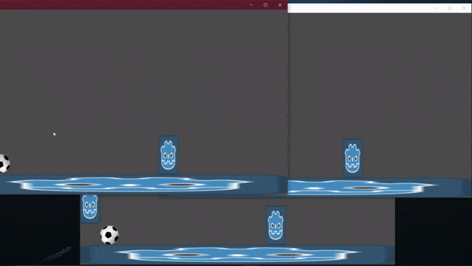
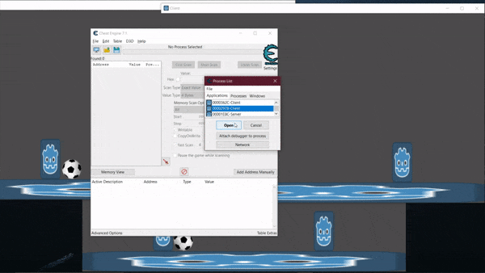

# GodotMultiplayer

This is example of multiplayer game with client/server architecture and server authoritativeness.

# Features

  - Dedicated server
  - Authoritative movement
  - Rooms
  - Matchmaking
  - Serverside physics

# Demo

# Demo (Authoritative movement)

On the gif we can see, that speedhack works only on client. And on the other clients and the server (server debug window at the bottom) we can see that the player moves as we expect.
